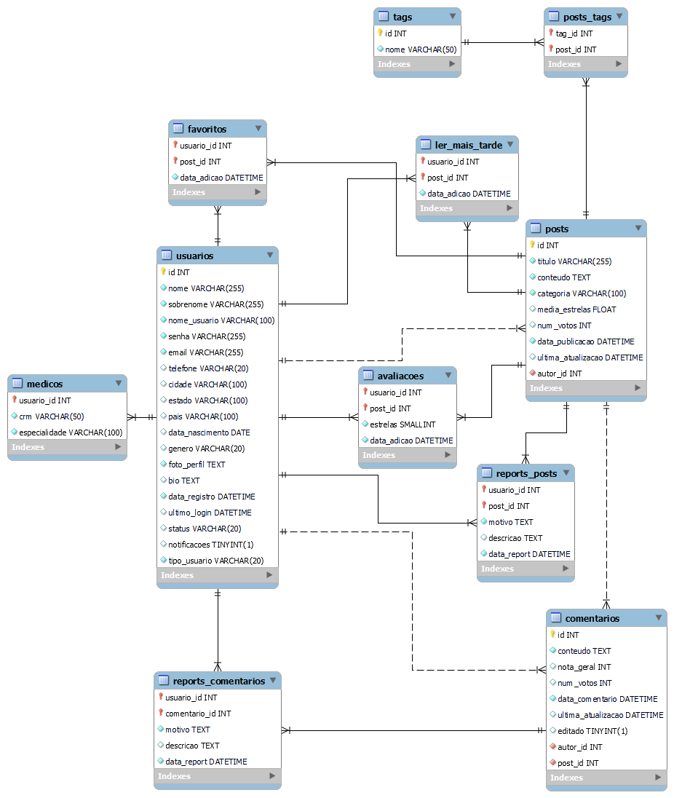

<div id="doc-header" align="center">
<h1>
⚕️ Saúde + Solidária ⚕️
</h1>

<p>
    
</p>

<p>
    
     
    <a href="https://github.com/jvitor-alol/Saude-Solidaria/commits/main/">
    
    </a>
</p>
</div>

## 💻 Sobre o projeto

Projeto desenvolvido como parte da disciplina Projeto Integrador IV: Desenvolvimento de sistemas orientado a dispositivos móveis e baseados na web.

<div id="tech-stack" align="center">
  


</div>

## 🔘 Objetivo do projeto

Temos visto que a saúde preventiva tornou-se uma preocupação global devido a pandemia, o medo de uma nova doença desconhecida está na mente da população. Este projeto visa criar uma ferramenta que ofereça ampla e unificada informação e conscientização sobre saúde preventiva, sem discriminação de idade e gênero. Sendo sáude física ou mental, devemos nos cuidar diariamente, nosso projeto mostrará ao indivíduo como cuidar de si da melhor forma.

## 🎨 Layout

O layout da aplicação está disponível no Figma:

[](https://www.figma.com/files/project/77994470/%F0%9F%93%84-Templates-para-Projetos%2C-Eventos-e-Cursos?fuid=1110596132085818429)

## 🎲 Banco de Dados

O SGBD escolhido foi o PostgreSQL, ideal para aplicações que requerem alta conformidade com padrões SQL, extensibilidade, suporte a dados complexos e alta confiabilidade.

Abaixo se encontra um diagrama que descreve todas as entidades e relacionamentos definidas nos `models` da aplicação.



## ⚙️ Dependências

- [Docker](https://docs.docker.com/guides/getting-started/)
- [Docker Compose](https://docs.docker.com/compose/)

## 🔨 Configurando o ambiente

- Clone o repositório

- Crie um arquivo .env na raíz com as seguintes variáveis de ambiente configuradas (modifique usuários, senhas e chaves de acordo):

  ```env
  FLASK_APP=run.py
  FLASK_CONFIG=production
  SECRET_KEY=< flask-secret-key >
  POSTGRES_USER=flask_app
  PGUSER=${POSTGRES_USER}
  POSTGRES_PASSWORD=< super-secret-password >
  POSTGRES_HOST=db
  POSTGRES_PORT=5432
  POSTGRES_DB=saude_solidaria
  DATABASE_URL=postgresql://${POSTGRES_USER}:${POSTGRES_PASSWORD}@${POSTGRES_HOST}:${POSTGRES_PORT}/${POSTGRES_DB}
  PGADMIN_DEFAULT_EMAIL=< admin@pgadmin.com >
  PGADMIN_DEFAULT_PASSWORD=< password >
  TZ=America/Sao_Paulo
  ```

## 🛣️ Executando a aplicação

- Dentro de `/deploy` execute o Docker Compose com

```bash
docker compose up -d
```

Acesse o web GUI a partir da porta mapeada no host em `http://localhost:8888/`.

## 👥 Colaboradores

<div align="center">
    <table style="width: 100%; border-collapse: collapse; text-align: center;">
    <tr>
        <td style="padding: 20px; border: 1px solid #ddd; vertical-align: middle;">
            
            <a href="https://github.com/Guilherme-Soares05" target="_blank"><p>Guilherme-Soares05</p></a>
        </td>
        <td style="padding: 20px; border: 1px solid #ddd; vertical-align: middle;">
            
            <a href="https://github.com/Rosicre" target="_blank"><p>Rosicre</p></a>
        </td>
        <td style="padding: 20px; border: 1px solid #ddd; vertical-align: middle;">
            
            <a href="https://github.com/mirelaads" target="_blank"><p>mirelaads</p></a>
        </td>
        <td style="padding: 20px; border: 1px solid #ddd; vertical-align: middle;">
            
            <a href="https://github.com/dkexs" target="_blank"><p>dkexs</p></a>
        </td>
    </tr>
    <tr>
        <td style="padding: 20px; border: 1px solid #ddd; vertical-align: middle;">
            
            <a href="https://github.com/PedroBrito22" target="_blank"><p>PedroBrito22</p></a>
        </td>
        <td style="padding: 20px; border: 1px solid #ddd; vertical-align: middle;">
        </td>
        <td style="padding: 20px; border: 1px solid #ddd; vertical-align: middle;">
        </td>
        <td style="padding: 20px; border: 1px solid #ddd; vertical-align: middle;">
        </td>
    </tr>
  </table>
</div>
